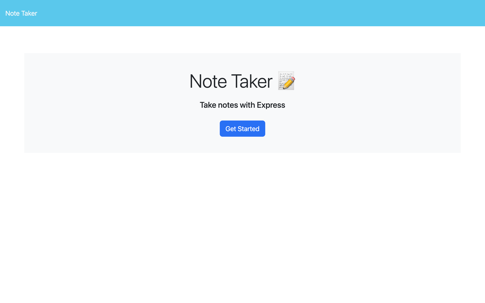
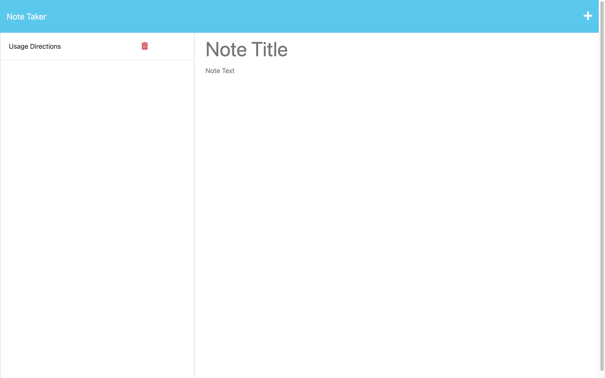

# Note Taker (Module 11 Homework - Express)

The goal was to create a note taking application so that the user can keep themself organized. The requirements were:
  - Present a landing page with a link to a notes page.
  - The link to the notes page presents a page with existing notes and empty fields that can be used to enter a new note
  - When a title and body are created for a note, a Save icon appears in the navigation bar
  - Clicking the Save button saves the new note to the existing notes column
  - Existing notes can be clicked on to display in the column on the right
  - Clicking the Write (plus) icon presents empty fields to enter a new note
  - The delete button on an existing note allows the user to delete the note

## Usage

1. To use the application, navigate to the notes page with:
    ```
    Get Started
    ``` 
2. If you are loading the application for the first time, click on existing note on the left titled:
    ```
    Usage Directions
    ```
3. To create a new note, click the "+" button in the header and add a title and body text for your note.

4. To save a note (once you have a title and body text), click the "save" icon in the header.

5. To view an existing note, click on the note title in the left column of the page.

6. To delete an existing note, press the "red trash can" button of the note you want to delete.


## Visual Examples






## Deployed Application (Heroku)

[Deployed Application on Heroku](https://a-down-note-taker-a4f5d9c37c25.herokuapp.com/){:target="_blank"} 